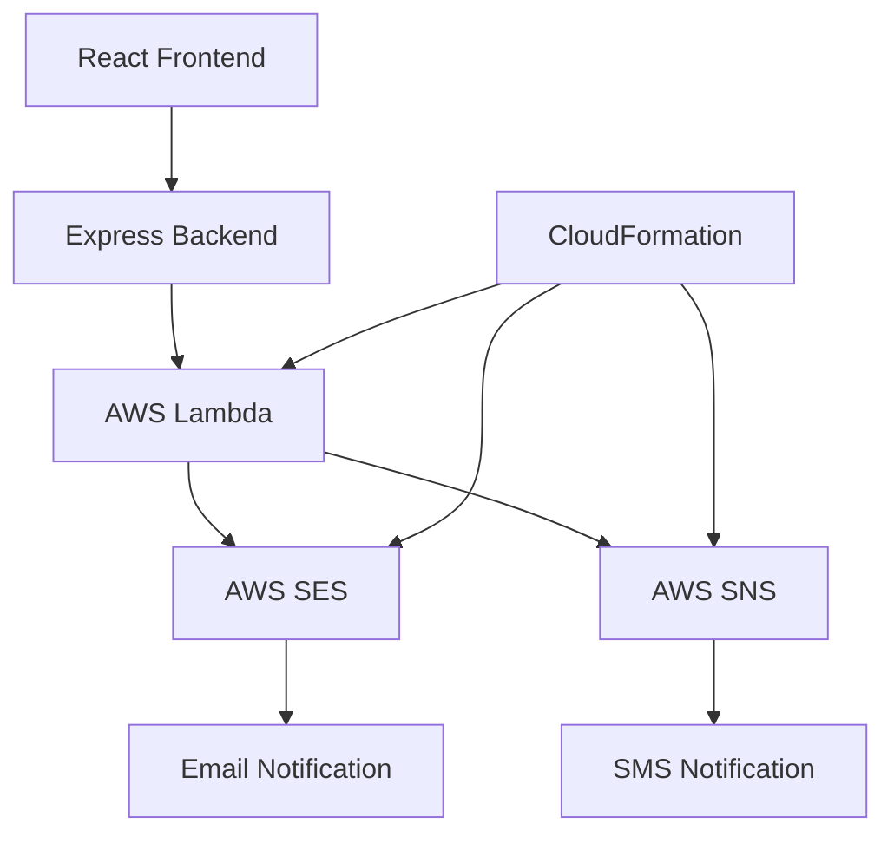

# AWS Integration for Portfolio Contact Form

This directory contains the AWS infrastructure implementation for the portfolio's contact form. This integration uses AWS Lambda, SES, and SNS to process form submissions, send email notifications, and send SMS alerts.

## Architecture Overview




## Components

1. **Lambda Function (`contactLambda.js`)**
   - Processes form submissions
   - Validates data
   - Sends email notifications via SES
   - Sends SMS alerts via SNS

2. **CloudFormation Template (`cloudformation-template.yaml`)**
   - Defines the AWS infrastructure as code
   - Creates the Lambda function
   - Sets up API Gateway
   - Configures IAM roles/permissions
   - Sets up SES/SNS resources

3. **Deployment Script (`deployLambda.js`)**
   - Automates the deployment process
   - Packages Lambda code
   - Uploads to S3
   - Updates the Lambda function

## Prerequisites

Before deploying this solution, you need:

1. An AWS account with appropriate permissions
2. AWS CLI installed and configured
3. Node.js (v14+)
4. The email address (paul.p.toner@gmail.com) must be verified in AWS SES
5. For production, move SES out of sandbox mode (requires AWS support ticket)

## Configuration

1. Copy `.env.example` to `.env` in the server directory
2. Fill in your AWS credentials and configuration:
   ```
   AWS_REGION=us-east-1
   LAMBDA_FUNCTION_NAME=dev-portfolio-contact-form
   S3_BUCKET=dev-portfolio-lambda-code
   ENVIRONMENT=dev
   AWS_ACCESS_KEY_ID=YOUR_ACCESS_KEY_HERE
   AWS_SECRET_ACCESS_KEY=YOUR_SECRET_KEY_HERE
   ```

## Deployment Steps

### 1. Create S3 Bucket

First, create an S3 bucket to store your Lambda code:

```bash
aws s3 mb s3://dev-portfolio-lambda-code --region us-east-1
```

### 2. Deploy CloudFormation Stack

Deploy the infrastructure using CloudFormation:

```bash
aws cloudformation deploy \
  --template-file cloudformation-template.yaml \
  --stack-name portfolio-contact-stack \
  --parameter-overrides \
    RecipientEmail=paul.p.toner@gmail.com \
    RecipientPhone=7202761928 \
    Environment=dev \
  --capabilities CAPABILITY_IAM
```

### 3. Deploy Lambda Code

Deploy the Lambda function code:

```bash
npm run deploy:lambda
```

## Testing

1. Start the Express backend:
   ```bash
   cd server
   npm install
   npm run dev
   ```

2. Start the React frontend:
   ```bash
   npm install
   npm run dev
   ```

3. Fill out and submit the contact form in the web application

## Security Considerations

- Environment variables are used to securely store sensitive information
- IAM roles are scoped with minimal required permissions
- API Gateway is configured to prevent unauthorized access
- Email/phone information is kept secure and not exposed in logs

## Troubleshooting

- Check CloudWatch Logs for Lambda execution errors
- Verify SES sender email is verified in your AWS account
- Ensure SNS has permission to send SMS to the target phone number
- Check IAM permissions if you experience authorization issues

## Future Enhancements

- Add DynamoDB to store form submissions
- Implement rate limiting to prevent abuse
- Add CAPTCHA or other anti-spam measures
- Set up monitoring and alerting for the Lambda function
